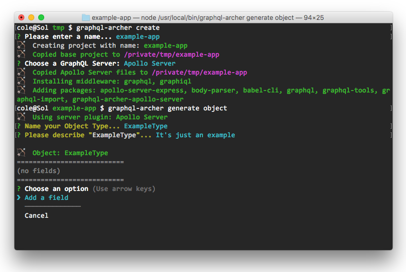

# graphql-archer

(WIP): Node cli for generating an Apollo server and bootstrapping your schema.

## Demo



```sh
cole@Sol tmp $ graphql-archer create
? Please enter a name... example-app
🏹   Creating project with name: example-app
🏹   Copied base project to /private/tmp/example-app
? Choose a GraphQL Server: Apollo Server
🏹   Copied Apollo Server files to /private/tmp/example-app
🏹   Installing middleware: graphql, graphiql
🏹   Adding packages: apollo-server-express, body-parser, babel-cli, graphql, graphql-tools, graphql-import, graphql-archer-apollo-server
cole@Sol example-app $ graphql-archer generate object
🏹   Using server plugin: Apollo Server
? Name your Object Type... ExampleType
? Please describe "ExampleType"... It's just an example

🏹   Object: ExampleType
===========================
(no fields)
===========================
? Choose an option (Use arrow keys)
❯ Add a field
  ──────────────
  Cancel
```
